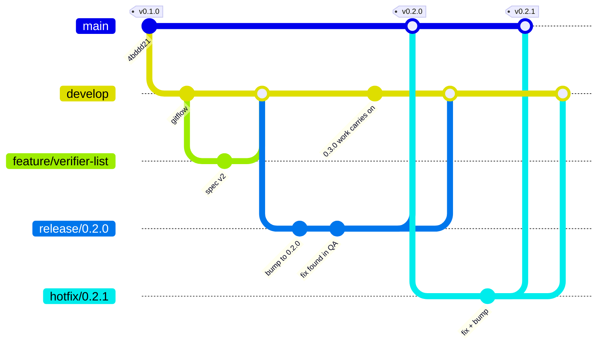

# Contributing

Thanks for improving redrob-eval.

## Setup

```bash
cp .env.example .env   # add provider keys you need
yarn install
yarn verify:phase1 && yarn verify:gepa && yarn verify:phase3
yarn verify:preference-gen
yarn verify:tool-routing
yarn test
yarn typecheck
```

Do not commit `.env`, caches, run artifacts, model weights, `.redrob/`, or local agent skill installs (`.agents/`, `skills-lock.json`).

## Branching model

Two long-lived branches:

- **`main` is production.** It only ever receives a release merge from `develop`, or a hotfix.
  Every commit on it is meant to be deployable, and is tagged. Do not push to it directly and do
  not open a pull request against it for ordinary work.
- **`develop` is the integration branch.** Everything lands here first. It is the base you branch
  from and the base your pull request targets.



Short-lived branches, all named for what they do:

| Prefix | Branch from | Merge into | For |
| --- | --- | --- | --- |
| `feature/` | `develop` | `develop` | anything additive |
| `fix/` | `develop` | `develop` | a bug that is not on fire |
| `refactor/` | `develop` | `develop` | behaviour-preserving change |
| `release/` | `develop` | `main` **and** `develop` | version bump, changelog, final checks |
| `hotfix/` | `main` | `main` **and** `develop` | a production defect that cannot wait |

`feat/` is accepted as a short form of `feature/`. Both appear in the history; neither is worth a
rename.

The two branches that merge to `main` also merge back to `develop`. Skipping the merge back is
how a fix reaches production and then disappears in the next release, so it is worth doing at the
time rather than remembering later.

```bash
git checkout develop && git pull
git checkout -b feature/short-description
# ... commits ...
git push -u origin feature/short-description   # then open a PR into develop
```

### Squash into `develop`, never into or out of `main`

This is the rule the rest of the model depends on, so it is worth stating on its own.

- **Feature, fix and refactor PRs into `develop`: squash by default.** One branch becomes one
  commit and `develop` stays readable. A branch whose commits are each already a self-contained
  logical change, not a trail of "wip" and "fix typo", may be merged with `--no-ff` instead, to
  keep boundaries that are worth bisecting later. Either is fine here; the point is that nothing
  merges into `develop` as a pile of noise.
- **Release and hotfix merges: real merge commits, `--no-ff`, never squash or rebase.** This one is
  not a preference.

A squash does not record that the two branches share history. It produces a brand new commit
holding the same text. So if you squash a hotfix into `main` and then squash it into `develop`,
Git does not know those are the same fix. The next release merge sees both sides changing the same
lines with no common ancestor to compare against, and reports a conflict for a fix that was already
applied on purpose. **Almost every "gitflow keeps colliding" story is this.** Real merge commits
give Git the shared ancestry it needs, and a change that has already flowed forward is silently
recognised as already present.

### Cutting a release and tagging it

```bash
git checkout develop && git pull
git checkout -b release/0.2.0

# bump the five version fields, update the changelog
git commit -am "Release 0.2.0"
git push -u origin release/0.2.0
# open a PR into main, run the manual QA pass below, merge it with a MERGE COMMIT

git checkout main && git pull
git tag -a v0.2.0 -m "redrob-eval 0.2.0"   # annotated, on the merge commit
git push origin v0.2.0
# publish it as a GitHub release -- this is what Zenodo mints the DOI from

git checkout develop && git pull           # and take the release back
git merge --no-ff release/0.2.0
git push
```

The tag goes on `main` **after** the merge, never on the release branch: the tag has to name the
commit that is actually production. Use `-a` so the tag carries an author, date and message;
`git describe` prefers annotated tags and Zenodo reads them.

### Making a hotfix

```bash
git checkout main && git pull
git checkout -b hotfix/0.2.1        # from main -- this is the whole point
# fix it, bump the patch version in the five files
git push -u origin hotfix/0.2.1
# PR into main, merge with a MERGE COMMIT, tag v0.2.1, publish

git checkout develop && git pull    # then forward it
git merge --no-ff hotfix/0.2.1
git push
```

Branch from `main`, not `develop`. `develop` holds unreleased features, so a fix built on top of it
drags them into production when it merges. Avoiding that is the only reason hotfix branches exist.

**If a release branch is open when the hotfix lands, merge the hotfix into the release branch
instead of into `develop`.** The release branch then carries it to `develop` through its own
merge-back, so the fix travels once, and, more importantly, the thing QA is testing now contains
the fix that is already in production.

### Why the three do not collide

The rule is: **fix each defect once, on the oldest branch that has it, then merge forward.** Fixes
travel `hotfix → main → develop` and `release → main → develop`. They never travel backwards, and
nothing is ever fixed twice.

| Where the bug is | Fix it on | Reaches |
| --- | --- | --- |
| In production and in `develop` | `hotfix/` from `main` | `main` by PR, `develop` by merge-back |
| Found during release QA | the `release/` branch | `main` and `develop`, by its two merge-backs |
| Only in unreleased work | `develop` | `develop` alone; production never had it |

Because `develop` receives the actual commit rather than a retyped copy of it, the next release
merge sees that commit in shared history and does nothing with it a second time. `develop` moving
on is fine and expected: the release branch was cut at a known point, and the merge only replays
what each side changed since that point.

Three things genuinely do conflict, and only the last one is a mistake:

1. **The version fields, always.** If `release/0.2.0` is open and a hotfix takes `main` to `0.1.1`,
   merging that hotfix conflicts on all five version fields. This is expected rather than a
   problem, so resolve it by keeping the release branch's number, `0.2.0`.
2. **Code that both sides really did change.** If a feature on `develop` rewrote the function a
   hotfix patched, the merge-back conflicts and it *should*. Resolve it once, in `develop`, with
   both versions visible.
3. **The same bug fixed independently in two places.** This is the avoidable one, and it is what
   the "fix it once, merge forward" rule exists to prevent.

## Releases and QA

**What a release branch is for.** Cutting `release/x.y.z` freezes the feature set for that version
while leaving `develop` open, so the next cycle's work is not blocked by whatever the release is
waiting on. Only three kinds of commit belong on it: the version bump, the changelog, and fixes
for defects found while testing it. A new feature on a release branch means the freeze did not
happen and the branch is just `develop` under another name.

**The version bump touches five files**, and missing one is the usual mistake: the `version` field
in the root, `apps/web`, `packages/harness` and `packages/tokenizers` `package.json`, plus
`version:` in `CITATION.cff`.

Those five are the whole list because the workspaces depend on each other by `"*"` rather than by
an exact version. Do not pin them: 0.2.0 shipped with `@redrob/harness` still asked for at
`0.1.0`, so `yarn install --frozen-lockfile` looked for a private package on npm and every CI job
failed, while a local install kept working because `node_modules` was already linked. Nothing here
is published, so an exact internal pin only adds a second place to remember.

**Run `yarn install --frozen-lockfile` on the release branch** before merging, in a clean checkout
rather than in your working tree. It is the one check that sees a version bump the way CI does.

**QA happens in three layers, and only the first two are automated.**

1. *Every pull request into `develop`* runs both workflows: typecheck, lint, the `verify:*`
   scripts, the byte-identity check on `exports/samples`, a production build, the TypeScript and
   Python conformance suites on Python 3.11 and 3.12, the zero-divergence diff between the two
   implementations, the reproducible-emit check, and a build with Python stripped from `PATH`.
2. *Every push to `develop` and `main`* runs the same thing again, which is what catches a merge
   that is fine in isolation and broken in combination.
3. *On the release branch*, by hand, the things CI structurally cannot do. CI has no browser, no
   API keys and no GPU, so none of the following is covered by a green build:
   - click through the UI: there are no end-to-end tests, so `yarn build` proves it compiles and
     nothing proves it works
   - one real call against a live provider key, since the `verify:*` scripts are deliberately
     offline and deterministic
   - if a GPU host is available, one `/deploy` smoke test through SSH, systemd and vLLM
   - upgrade from the previous tag with an existing `.env` and cached runs in place

Layer 3 is the reason the release branch exists here. Without it a release is only as good as a
build that never opened the application.

**Tagging.** Tag `main` after the release merge, `vX.Y.Z`, and publish it as a GitHub release.
This is a precondition for the citation metadata, not bookkeeping: `CITATION.cff` names a version,
and Zenodo mints a DOI from a published GitHub release. Until a tag exists, `version: 0.1.0` in
that file points at nothing a reader can obtain, which is why the spec currently tells readers to
pin a commit and why generated manifests carry `"doi": "TBD"`.

## Development

- App: `yarn dev` → http://localhost:3939 (only when you need the UI)
- Typecheck: `yarn typecheck`
- Production build: `yarn build`

Prefer changes in `packages/harness` for optimizer / metrics / providers; keep `apps/web` thin (UI + route handlers).

## Rules of the road

1. **No absolute currency** in UI, APIs, logs, or caches - relative cost weights / percentages only.
2. **No secrets** - keys stay in `.env` (gitignored). Rotate any key that was ever pasted into chat or a screenshot.
3. **Split isolation** - do not optimize against `test` if you also report test metrics. The API must refuse that.
4. **Datasets** - only Apache-2.0-compatible (or otherwise OSS-distributable) rows under `datasets/`. CC-BY-NC / gated material goes in `datasets/local/` (gitignored).
5. **GEPA** - TypeScript reimplementation in `packages/harness`; do not add a Python GEPA dependency to the app run path. Optional parity lives in `scripts/parity/`.
6. **Python** - `train/` and `scripts/parity/` are research-only; never required for `yarn install && yarn dev`.

## Pull requests

- **Target `develop`, not `main`.** A PR against `main` will be asked to retarget unless it is a
  release or a hotfix.
- Keep PRs focused; include why, not just what.
- Run the verify scripts that touch your change.
- Update README / NOTICE when adding datasets, attributions, or user-facing behavior.

## Code of conduct

Be respectful. Harassment or bad-faith abuse of issues/PRs will not be tolerated.
