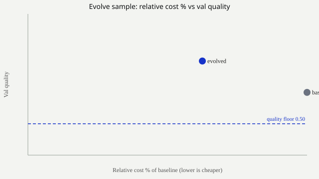

# redrob-eval

[English](README.md) · [한국어](README.ko.md)

[](https://github.com/redrob-labs/redrob-eval/actions/workflows/ci.yml)
[](LICENSE)

Open-source **LLM evaluation workbench** (Next.js App Router, Apache 2.0): compare any model from any source on your own task, settle quality by blind human preference, evolve configurations under a quality floor, and serve self-hosted models on your GPU.

The product is three modules plus settings: **Compare · Evolve · Deploy**. Compare is the front door - frontier APIs, OpenRouter, and your own vLLM endpoints all sit in the same list, on text or image, with audio slotting in as one more modality. Costs, where they appear at all, are **% of a baseline**, never absolute currency. Provider keys stay server-side.

## Findings

- Hand-written routing rules (prompt length, keywords) agreed with dual-model labels only about 25% of the time on some GSM8K slices. Not usable as a production policy. (See [`docs/learnings.md`](docs/learnings.md); dual-eval corpora stay under gitignored `eval/routing-runs/`.)
- A learned router trained on those labels failed to beat chance on the labels we cared about, and was dropped. The labeling pipeline survived; the router did not.
- Tokenizer fertility is a hard budget constraint on high-fertility languages: it shrinks how many demonstrations fit, so `demos_requested` and `demos_fitted` diverge and the effective search space narrows.

## Sample results (committed)

Regenerate offline with `yarn export:samples` (no API keys). Full files live in [`exports/samples/`](exports/samples/).

**Baseline vs evolved (excerpt):**

```text
Dataset: in22-gen-hi-en · Optimizer: gepa · Quality floor: 0.5

Baseline  val quality 0.6000 · val tokens 200 · demos 3/2
Evolved   val quality 0.7000 · val tokens 120 · demos 3/3

Token Δ (val): -80
Quality Δ (val): +0.1000
Relative cost vs baseline: 62.5%
```



Port is fixed at **`3939`**.

## Requirements

- **Node.js** 20+ (tested on 22)
- **Yarn** Classic 1.22 (`yarn` via Corepack is fine)
- An [OpenRouter](https://openrouter.ai/) API key (recommended) or another supported provider key

## Quick start

```bash
git clone https://github.com/redrob-labs/redrob-eval.git
cd redrob-eval
cp .env.example .env
# Edit .env and set OPENROUTER_API_KEY=...
yarn install
yarn verify:phase1
yarn verify:gepa
yarn verify:phase3
yarn export:samples
yarn dev
```

Open [http://localhost:3939](http://localhost:3939), which lands on Compare. The other pages are `/evolve`, `/deploy` and `/settings`. Restart `yarn dev` after editing `.env`.

Nothing else is required for a clean checkout - evaluation runs offline against vendored datasets; only provider API calls leave the machine. CI runs every `yarn verify:*` plus `yarn export:samples` and `yarn build` on each push.

## What it does

| Module | Path | Purpose |
|------|------|---------|
| **Compare** | `/` or `/compare` | Run any model from any source live on a catalog dataset or your own prompts, on text or image; rank by measured quality, latency, TTFT and throughput; settle unscored tasks with a blind preference tournament; turn those votes into a routing policy |
| **Evolve** | `/evolve` | GEPA search over instruction / demos / model / `script_policy` / `frame_policy` under a quality floor; catalog datasets or custom goal+rubric (LLM judge or checklist QWK); export baseline-vs-evolved report |
| **Deploy** | `/deploy` | Serve self-hosted S+L on your GPU host over SSH - measure, start, health, benchmark, resumable terminal |
| **Settings** | `/settings` | Provider keys and GPU host config, written to the gitignored root `.env` |

Typical loop: **Compare** to pick a model → **Evolve** under a quality floor → **Deploy** what you chose, then compare the served endpoint against the frontier again.

### Generate (under development, no UI yet)

A fourth module is being built: **Generate**, parametric generation of verifiable evaluation
prompts together with their verifiers. An item is a template plus a seed rather than a row in a
file, and the seed is *derived* from the generator version, the template id and the instance index
rather than chosen. That buys two things a static set cannot have. The items cannot have leaked
into pretraining, because they did not exist until someone ran the generator. And cherry-picking
becomes structurally impossible rather than discouraged, because any third party can recompute the
same seeds from published values and check them, which a conventional seed such as `42` does not
allow. Scoring is done by deterministic verifiers, not by a judge model.

What exists today is the foundation, not a feature: the [Redrob Verifiable Task Spec
v1](spec/verifiable-task-v2.md), a Python generator, verifiers implemented natively in both
languages, and a cross-language conformance suite that fails CI if the two ever disagree. There is
no page, no route and no navigation entry.

**Python stays optional.** `yarn install && yarn dev` is unchanged and still works on a machine
with no interpreter installed; CI has a job that builds with Python removed from `PATH` to keep it
that way. The TypeScript side reads and audits generated sets and runs every declarative verifier
natively, and it reaches for Python only through an explicit subprocess call that reports absence
with an actionable message instead of failing.

```bash
pip install -e packages/generate                     # optional, only to generate
redrob-generate emit --template templates/math/linear-equation --count 20 --out /tmp/set
redrob-generate verify --set /tmp/set --outputs answers.jsonl --json
yarn test                                            # the TypeScript half of the conformance suite
```

See [`packages/generate/README.md`](packages/generate/README.md) for a worked example and
[`templates/README.md`](templates/README.md) for the template layout. Templates are English-only
for now; the locale structure exists, but a translation needs native-speaker review before it can
be used, and none has had one.

### Compare's four stages

1. **Setup** - pick a modality, pick models across every source (curated, OpenRouter, direct frontier, self-hosted vLLM), then a catalog dataset, an image prompt suite, or your own prompts pasted or uploaded as JSONL.
2. **Run** - streams live over SSE. Quality is scored only when the task has reference answers; latency, TTFT and throughput are always measured on this run. No cost column, because published pricing is never real time.
3. **Preference** - one single-elimination bracket per prompt. Two answers at a time with model names hidden, winner advances, champion takes the prompt. Non-power-of-two fields pad with byes; a model that errored on a prompt loses by walkover. For image, "let the judge decide" hands a match to a vision model and you can still vote the rest. Votes append to `eval/tournaments/{runId}/votes.jsonl`.
4. **Optimize route** - name a fast model and a fallback. Every prompt the fast one won or tied becomes a `small` label, the rest escalate. These land in the same `RoutingExample` corpus the metric-derived collector fills, so `/api/routing/export` and the training path are unchanged - the supervision is just human now instead of metric.

Offline check for the bracket and label logic: `yarn verify:tournament`.

Checklist / video skill scoring (custom goal `mode: "checklist"` or `datasets/video-local/` manifests) evolves a judging prompt + `frame_policy` for agreement with human graders (QWK), not task accuracy. Frames are sampled in memory only - no video bytes are persisted.

Shared rules:

- Provider keys via server `.env` only (never sent to the browser)
- Costs are **relative percentages** of a run baseline - never absolute currency
- Metrics return `{ score, feedback }` text alongside the number
- Train/val may be optimized against; **test is reported once** and the API refuses reporting test if it was also optimized against

## Monorepo layout

| Path | Role |
|------|------|
| `apps/web` | Next.js UI + API routes |
| `packages/harness` | Optimizer, eval, metrics, datasets, providers (`@redrob/harness`) |
| `packages/tokenizers` | Fertility via HF `AutoTokenizer` (`@redrob/tokenizers`) |
| `datasets/` | Vendored eval subsets (Apache-compatible licenses only); `video-local/` for non-redistributable checklist manifests |
| `exports/samples/` | Committed, regenerable sample Evolve report + Pareto SVG |
| `scripts/parity/` | Optional research comparison vs reference GEPA - **not** needed to run the app |
| `spec/` | Redrob Verifiable Task Spec v2 + the cross-language conformance suite |
| `templates/` | Generate templates, one directory per family, with locale layers |
| `packages/generate` | Optional Python generator `redrob-generate` - **not** on the `yarn install && yarn dev` path |
| `train/` | Optional Python router training - **not** on the `yarn install && yarn dev` path |

Workspace packages are marked `"private": true` (consumed in-repo; not published to npm).

## Attribution - GEPA

This repo reimplements [GEPA](https://github.com/gepa-ai/gepa) (Genetic-Pareto) in TypeScript from the paper ([arXiv:2507.19457](https://arxiv.org/abs/2507.19457)). Cite as **agrawal2025gepa**. See [`NOTICE`](NOTICE). Implementation: `packages/harness/src/lib/optimizer/gepa/` - not a file-by-file port of `src/gepa/`.

On **Evolve**, pick a catalog dataset or **Custom goal** (goal + rubric + input-only JSONL; LLM-as-judge). **Seed model** runs the candidate prompt; **reflect model** rewrites it from failure feedback; **judge** (custom mode) scores answers against your rubric. Offline: `yarn verify:gepa`, `yarn verify:phase3`, `yarn verify:custom-goal`. Export reports via `GET /api/optimize/runs/:id?export=md`.

## Docs

- [Contributing](CONTRIBUTING.md)
- [Security](SECURITY.md)
- [Methodology](docs/methodology.md) - routing labels, features, export
- [Preference](docs/preference.md) - blind brackets, and how votes become routing labels
- [Learnings](docs/learnings.md) - living design log
- [Decision records](docs/decisions/) - why a design is the way it is, one file per decision,
  numbered and never rewritten in place. Start with
  [0001 Generate module foundation](docs/decisions/0001-generate-foundation.md), then
  [0002 Unicode semantics](docs/decisions/0002-unicode-semantics.md) and
  [0003 List-valued verifier field](docs/decisions/0003-list-valued-verifier-field.md).
- [Sample exports](exports/samples/README.md) - regenerable report + Pareto

## Environment

| Variable | Provider |
|----------|----------|
| `OPENROUTER_API_KEY` | OpenRouter (recommended) |
| `OPENAI_API_KEY` | OpenAI |
| `ANTHROPIC_API_KEY` | Anthropic |
| `GOOGLE_API_KEY` | Google Gemini |
| `TOGETHER_API_KEY` | Together |
| `FIREWORKS_API_KEY` | Fireworks |
| `HF_TOKEN` | Hugging Face (dataset fetcher; required for GPU deploy downloads) |
| `VLLM_API_KEY` | Self-hosted vLLM bearer (auto-issued by `/deploy` if unset) |
| `VLLM_S_BASE_URL` / `VLLM_L_BASE_URL` | OpenAI-compatible endpoints for axis S / L (defaults: loopback ports via tunnel) |

Set every key at `/settings` in the app, or via the environment. GPU deploy details (`GPU_HOST`, `GPU_USER`, `GPU_SSH_KEY`, …) never leave the gitignored root `.env` — see [`deploy/README.md`](deploy/README.md). Do not put hostnames, usernames, key paths, or API keys in the repo.

### Self-hosted relative cost

Self-hosted models have no API $/token. Relative cost uses measured throughput:

`relativeCostWeight(m) = 100 * (tok_per_sec_L / tok_per_sec_m)`

Large-alone = 100 (GPU-time per token). Run **Benchmark** on `/deploy` after both models are serving; it records `MEASURED_TOK_PER_SEC_*` on the GPU host and the app picks them up. FP8 vs bf16 must appear in result caveats — never mix precisions in one table without that note.

Indic L-candidate A/B (Gemma 4 31B vs Qwen3.6 27B): compare on **IN22-Gen** and **IndicGLUE** slices (`in22-gen-hi-en`, `indic-glue-iitp-mr-hi`).

Keep `.env` at the **repo root**. Next loads it via `apps/web/next.config.ts`.

## API (high level)

**Optimize / Evolve**

- `POST /api/optimize` → `{ runId }`
- `GET /api/optimize/runs/:id/events` - SSE
- `GET /api/optimize/runs/:id` - meta + result + report
- `GET /api/optimize/runs/:id?export=md|json` - downloadable report

**Compare**

- `POST /api/compare/run` - SSE; dispatches on `modality` (`text` | `image`)
- `POST /api/compare/tournament` - build one bracket per prompt from a run's answers
- `GET /api/compare/tournament/:id` - meta + brackets + votes + standings
- `POST /api/compare/tournament/:id/vote` - record a blind vote and advance
- `POST /api/compare/tournament/:id/judge` - let the modality's model judge decide one match
- `POST /api/compare/tournament/:id/route-policy` - preference labels, save rate, optional corpus write

**Routing collection**

- `POST /api/routing/collect` → `{ runId }`
- `GET /api/routing/runs/:id/events` - SSE
- `GET /api/routing/export?format=chat|flat` - training JSONL

**Headless**

- `POST /api/eval` - SSE text eval with the optional router baseline (`includeRouter`)
- `POST /api/preference/runs` - K×M preference generation, no UI needed
- `GET|POST /api/score` - metric fixtures and one-off scoring

Also: `/api/models`, `/api/datasets`, `/api/image/suites`, `/api/status`, `/api/probe`, …

## CLI

```bash
yarn verify:phase1   # datasets, splits, relative cost helpers
yarn verify:gepa     # GEPA unit checks (offline)
yarn verify:phase3   # script_policy, demo fit, report (offline)
yarn verify:custom-goal  # custom goal parse + judge JSON (offline)
yarn verify:video    # frame_policy, QWK, rubric lint (offline)
yarn verify:tournament   # preference brackets + preference-derived routing labels (offline)
yarn verify:selfhosted   # self-hosted catalog + relative cost, no currency (offline)
yarn verify:preference-gen  # preference run planning + matrix (offline)
yarn export:samples  # write exports/samples report + Pareto SVG
yarn test            # TypeScript conformance suite for the Generate spec (offline)
yarn generate:spec-types  # regenerate TS types from spec/verifiable-task-v2.schema.json
yarn typecheck
yarn lint
yarn build
yarn probe
yarn datasets:fetch  # regenerate vendored JSON (not needed at runtime)
yarn export:routing
```

### Optional: train routers (Python research)

```bash
pip install -r train/requirements-mlp.txt
yarn train:mlp
yarn train:event-detect
```

See [`train/README.md`](train/README.md).

## Tips

- Start with **5-20 samples** while iterating
- Exact-match datasets default to threshold `0.99`
- Oracle on the Pareto chart is the training-target upper bound for the labeling rule
- High tokenizer fertility shrinks demos that fit - watch `demos_requested` vs `demos_fitted` on Evolve reports

## Author

Built by Janghoon Lee (이장훈)

## License

Apache-2.0. Copyright 2026 Redrob. See [`LICENSE`](LICENSE) and [`NOTICE`](NOTICE).
